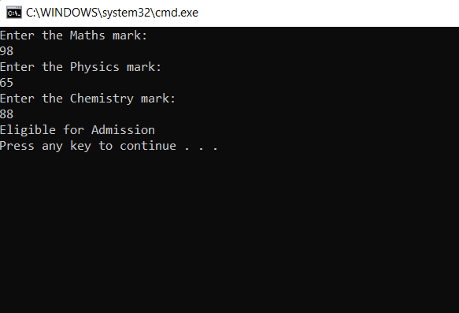

# Eligibility-for-Admission

## Aim:
To write C# program to find the eligibility for admission to an engineering course

## Algorithm:
```
1) Start the program
2) Declare variables to store physics, chemistry and math marks, total marks and percentage.
3) Ask the user to input the physics, chemistry, and math marks.
4) Read the values of physics, chemistry, and math marks from the user.
5) Calculate the total marks as the sum of physics, chemistry, and math marks.
6) Calculate the total marks as the sum of physics and math marks.
7) Check if the total mark of maths, physics and chemistry is greater or equal to the given condition or total marks of maths and physics is greater then or      equal to given condition.
8) If the conditions in step 7 are true, display "You are eligible for admission to an engineering course."
9) If the conditions in step 7 are false, display "You are not eligible for admission to an engineering course."
10)End the program
```
## Program:
```
using System;
using System.Collections.Generic;
using System.Linq;
using System.Text;
using System.Threading.Tasks;

namespace ex1
{
    class Program
    {
        static void Main(string[] args)
        {
            int m, p, c;
            Console.WriteLine("Enter the Maths mark:");
            m = Convert.ToInt32(Console.ReadLine());
            Console.WriteLine("Enter the Physics mark:");
            p = Convert.ToInt32(Console.ReadLine());
            Console.WriteLine("Enter the Chemistry mark:");
            c = Convert.ToInt32(Console.ReadLine());
            int tot,tm;
            tot = m + p + c;
            tm = m + p;
            
            if (m>= 65 && p >= 55 && c >= 50)
            {
                if (tot >= 180 || tm >= 140)
                    Console.WriteLine("Eligible for Admission");
                else
                    Console.WriteLine("Not eligible for Admission");
            }
            else
                Console.WriteLine("Not eligible for Admission");
        }
    }
}
```


## Output:



## Result:
Thus, the C# program to find the eligibility for admission to an engineering course has been executed successfully.


